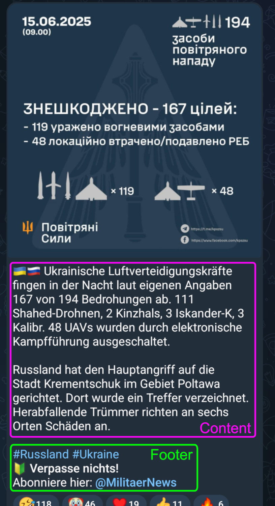
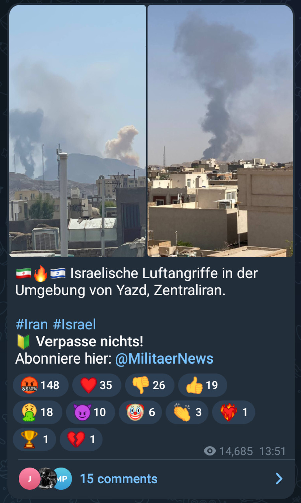
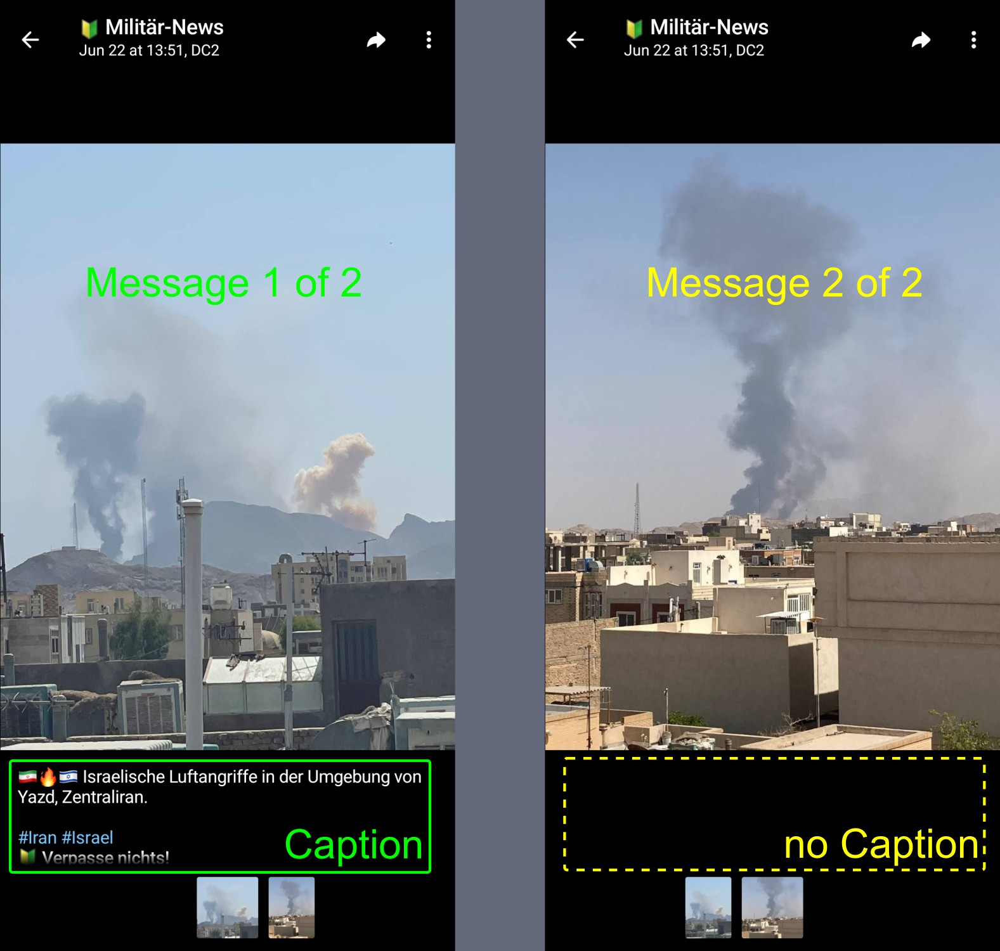
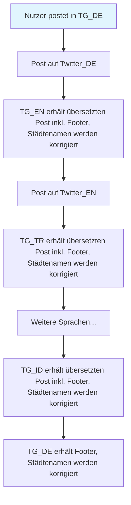
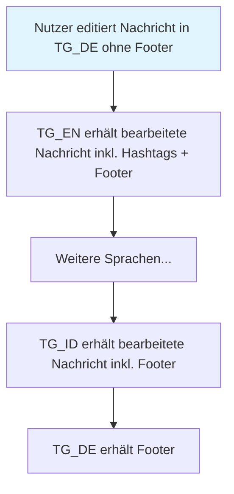

# 🔰 Übersicht für MN-Redakteure

Um den Prozess des Postens für Redakteure zu erleichtern, setzen wir stark auf Automatisierung in Form von Bots. Dieses Dokument soll dir eine Übersicht geben wie genau mit den Limits seitens Telegram und unserem [PostingBot](https://t.me/militaernews_posting_bot) umzugehen ist.

## Begriffsabgrenzung

Ein _Post_ besteht aus _Content_ und _Footer_.

* Der Content ist das einzige, was du als Redakteur beim Posten mit senden musst.

* Der Footer wird durch den PostingBot hinzugefügt. Der Footer besteht aus Hashtags mit Länder-Namen entsprechend der Flaggen-Emojis im Content und einer Aufforderung den Kanal zu abonnieren.

Ein Post kann ein oder bis zu zehn _Nachrichten_ mit _Medien_ (Bild, Video, Animation) beinhalten. Der Text darunter nennt sich _Caption_.

Hat ein Post mehrere Medien, so ist er eine _Mediagroup_. Technisch gesehen sind eine Mediagroup mehrere einzelne Nachrichten mit Medien, welche dieselbe _mediagroup_id_ haben. Die Telegram-App erkennt dies und gruppiert diese Nachrichten, sodass sie so aussehen als wäre es eine Nachricht.

Haben mehrere Nachrichten derselben Mediagroup eine Caption, so wird keine Caption direkt unter der Mediagroup mehr angezeigt. Stattdessen muss der Nutzer auf ein Medium klicken und durch die Medien wischen um jeweils die hinterlegte Caption sehen zu können.

* Die Caption ist auf eine Länge von 1024 Symbole beschränkt ([Übersicht zu Telegrams Limits](https://limits.tginfo.me/de-DE)). Mit Premium erhöht sich dieses Limit für Nutzer auf 4096 Symbole, für Bots jedoch nicht. Da Hashtags und Footer hinzukommen, empfiehlt sich eine maximale Länge des Contents von rund 900 Zeichen. Dies kannst du mit [CharacterCountOnline](https://www.charactercountonline.com/) nachzählen lassen.

## Posting-Pipeline

MN betreibt Telegram-Kanäle in zahlreichen Sprachen:

* 🇩🇪 TG_DE (Deutsch): [@MilitaerNews](https://t.me/militaernews)
* 🇺🇸 TG_EN (Englisch): [@MilitaryNewsEN](https://t.me/MilitaryNewsEN)
* 🇹🇷 TG_TR (Türkisch): [@MilitaryNewsTR](https://t.me/MilitaryNewsTR)
* 🇮🇷 TG_FA (Persisch): [@MilitaryNewsFA](https://t.me/MilitaryNewsFA)
* 🇷🇺 TG_RU (Russisch): [@MilitaryNewsRU](https://t.me/MilitaryNewsRU)
* 🇧🇷 TG_PT (Portugiesisch): [@MilitaryNewsBR](https://t.me/MilitaryNewsBR)
* 🇪🇸 TG_ES (Spanisch): [@MilitaryNewsES](https://t.me/MilitaryNewsES)
* 🇫🇷 TG_FR (Französisch): [@MilitaryNewsFR](https://t.me/MilitaryNewsFR)
* 🇮🇹 TG_IT (Italienisch): [@MilitaryNewsITA](https://t.me/MilitaryNewsITA)
* 🇪🇬 TG_AR (Arabisch): [@MilitaryNewsAR](https://t.me/MilitaryNewsAR)
* 🇮🇩 TG_ID (Indonesisch): [@MilitaryNewsIDN](https://t.me/MilitaryNewsIDN)

Zudem gibt es je einen Twitter-Account auf [Deutsch 🇩🇪](https://x.com/MilitaerNews) und [Englisch 🇺🇸](https://x.com/MilitaryNewsEN).

Das Posten in all diesen Destinationen findet automatisiert statt, basierend auf den Inhalten die im deutschsprachigen Kanal hochgeladen werden. Dieser vollautomatisierte Prozess ist die Posting-Pipeline.

Der Bot reagiert auf einzelne Updates, bspw. ein Nutzer tritt einer Gruppe bei, der Titel eines Chats wird geändert oder eben auch: Eine neue Nachricht wird in einem Chat gesendet. In unserem Fall in TG_DE.

Bei einer Mediagroup wartet der Bot jeweils einige Sekunden ob noch eine weitere Nachricht mit derselben mediagroup_id gepostet wird. Wenn nichts weiteres kommt, dann wandert die Mediagroup durch die Posting-Pipeline. Es braucht also technisch bedingt etwas bis die Posting-Pipeline hierdurch laufen kann und der Post in allen Kanälen gepostet wurde. Deshalb einen Post, insbesondere wenn dieser eine Mediagroup ist, nicht direkt bearbeiten.

Die Posting-Pipeline läuft Schritt für Schritt durch. Für einen Post auf Twitter müssen sämtlich Medien aus dem Post in TG_DE erst heruntergeladen und dann jeweils für Twitter_DE und Twitter_EN hochgeladen werden. Je nach Größe und Anzahl der Medien kann dies lange dauern. Deshalb nicht besorgt sein, falls es etwas länger dauert bis am Ende in TG_DE die Hashtags und der Footer hinzugefügt werden.

## Nachricht editieren

Wenn eine Nachricht auch in den anderen Telegram-Kanälen editiert werden soll, so ist in TG_DE der Footer zu entfernen.

Städtenamen werden beim Editieren einer Nachricht nicht korrigiert.

Die Posts auf Twitter können nicht nachträglich bearbeitet werden.

## 

## Wichtige Funktionen

### Hashtags
- _Keine manuellen Hashtags erforderlich_
- Der Bot generiert Hashtags automatisch basierend auf verwendeten Emojis
- Einfach relevante Emojis im Text verwenden

### Mediengruppen (Alben)
Beim Senden mehrerer Medien gleichzeitig:
- _Längere Verarbeitungszeit_ ist normal
- Bot erkennt einzelne Nachrichten, nicht das komplette Album
- Wartet automatisch auf alle Medien einer Gruppe (identische Mediengruppen-ID)
- Sendet erst nach vollständigem Empfang weiter

### Große Mediendateien
- _Längere Upload-Zeit_ bei mehreren MB
- Grund: Medien werden für Twitter-Integration herunter- und wieder hochgeladen
- Betrifft DE und EN Kanäle mit Twitter-Accounts

## Post-Bearbeitung

### Bearbeitung von Posts
- Posts in _DE_Telegram können bearbeitet werden_
- Änderungen werden nur übernommen, wenn:
  - _Hashtags am Ende entfernt werden_
  - _Footer am Ende entfernt wird_

### Empfohlener Workflow
1. _Ersten Post ohne Formatierung/Links_ senden
2. _Nur DE_Telegram nachträglich formatieren_
3. Grund: Übersetzung kann Formatierung und Links in anderen Sprachen beschädigen

## Technische Hinweise

### Formatierungs-Platzhalter
- Symbol `║` in anderen Kanälen = Formatierungs-Platzhalter
- Tritt auf, wenn Google Translate die Formatierung nicht korrekt übertragen kann

### Zeichenlimits beachten

#### Caption-Limit (Text unter Medien)
- _Telegram-Limit: 1024 Zeichen_
- _Empfohlenes Limit: ~900 Zeichen_
- Grund: Footer wird automatisch hinzugefügt
- Footer kann bei mehreren Flaggen-Emojis sehr lang werden

#### Besondere Vorsicht bei #eilmeldung
- Text wird als _Bild mit Caption_ neu gepostet
- Zeichenlimit gilt für gesamten Inhalt
- Kurze, prägnante Texte verwenden

## Best Practices

### ✅ Empfohlenes Vorgehen
- Konservativ ~900 Zeichen für Haupttext einplanen
- Relevante Emojis für automatische Hashtags nutzen
- Bei Alben: Geduld für vollständige Verarbeitung
- Erst unformatiert posten, dann DE formatieren

### ❌ Zu vermeiden
- Manuelle Hashtags hinzufügen
- Posts über 900 Zeichen (besonders mit Medien)
- Erwartung sofortiger Weiterleitung bei großen Medien
- Bearbeitung ohne Entfernung von Hashtags/Footer

## Troubleshooting

### Post wird nicht weitergeleitet?
- Prüfen: Hashtags und Footer entfernt bei Bearbeitung?
- Warten bei Mediengruppen und großen Dateien
- Bei #eilmeldung: Zeichenlimit prüfen

### Formatierung kaputt in anderen Sprachen?
- Normal bei Übersetzung
- Nur DE_Telegram nachträglich formatieren
- `║` Symbole ignorieren (Formatierungs-Platzhalter)

## Content Richtlinien

* Der Content hat mit den Flaggen der Länder zu beginnen, um die es im danach folgenden Text gehen soll.
* Neben Flaggen
* Die Caption ist auf eine Länge von 1024 Zeichen beschränkt. Da Hashtags und Footer hinzukommen, empfiehlt sich eine maximale Länge des Contents von rund 900 Zeichen. Dies kannst du mit [CharacterCountOnline](https://www.charactercountonline.com/) nachzählen lassen.
* Inhalten die [Telegrams TOS](https://telegram.org/tos/de) widersprechen könnten, versuchen wir im Kanal zu vermeiden. Die Verbreitung solcher Inhalte könnte zur Meldung des Kanals durch Nutzer führen und sofern legitim zur Sperrung seitens Telegram.
* Replies auf vorige Posts werden in den anderen Kanälen übernommen.