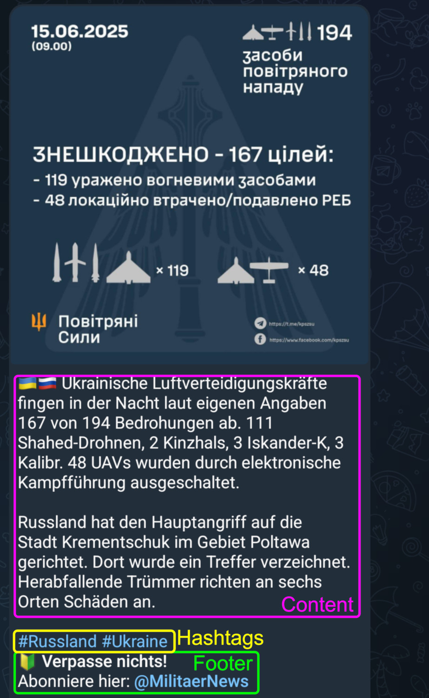
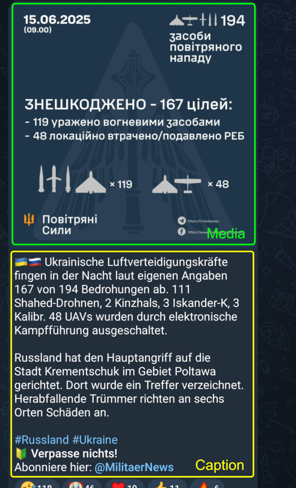
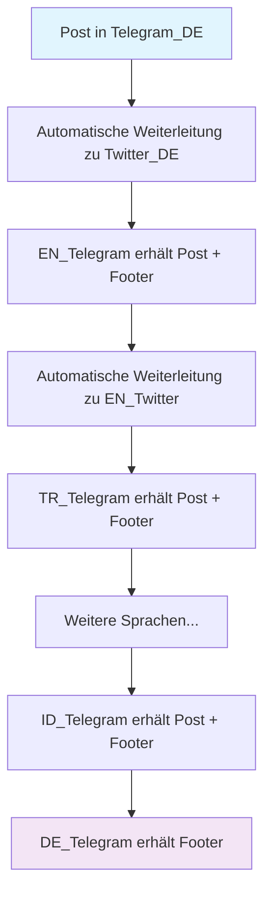

# Übersicht für MN-Redakteure

Um den Prozess des Postens für Redakteure zu erleichtern, setzen wir stark auf Automatisierung in Form von Bots. Dieses Dokument soll dir eine Übersicht geben wie genau mit den Limits seitens Telegram und unserem [PostingBot](https://t.me/militaernews_posting_bot) umzugehen ist.

## Aufbau eines Posts

Ein Post besteht aus Content, Hashtags und Footer. Der Content ist das einzige, was du als Redakteur beim Posten mit senden musst. Den Rest übernimmt der PostingBot.

Ein Post kann ein oder bis zu zehn Medien (Bild, Video, Animation) beinhalten. Der Text darunter nennt sich Caption. 

Eine Mediagroup sind mehrere Nachrichten mit Medien, welche die selbe mediagroup_id haben. Die Telegram-App erkennt dies und gruppiert diese Nachrichten, sodass sie so aussehen als wäre es ein Post.

###### todo

## Posting-Pipeline

MN betreibt Telegram-Kanäle in zahlreichen Sprachen sowie je einen Twitter-Account auf [Deutsch](https://x.com/MilitaerNews) und [Englisch](https://x.com/MilitaryNewsEN). Das Posten in all diesen Destinationen findet automatisiert statt, basierend auf den Inhalten die im deutschsprachigen Kanal hochgeladen werden. Diesen vollautomatisierte Prozess ist die Posting-Pipeline.

Der Bot reagiert auf einzelne Updates

Die Posting-Pipeline läuft Schritt für Schritt durch.

Bei Mediagroups wartet der Bot jeweils

Für einen Post auf Twitter müssen sämtlich Medien aus dem Post in Telegram_DE erst heruntergeladen und dann jeweils für Twitter_DE und Twitter_EN hochgeladen werden. Je nach Größe und Anzahl der Medien kann dies lange dauern. Deshalb nicht besorgt sein, falls es etwas länger dauert bis am Ende in Telegram_DE die Hashtags und der Footer hinzugefügt werden.

## Wichtige Funktionen

### Hashtags
- **Keine manuellen Hashtags erforderlich**
- Der Bot generiert Hashtags automatisch basierend auf verwendeten Emojis
- Einfach relevante Emojis im Text verwenden

### Mediengruppen (Alben)
Beim Senden mehrerer Medien gleichzeitig:
- **Längere Verarbeitungszeit** ist normal
- Bot erkennt einzelne Nachrichten, nicht das komplette Album
- Wartet automatisch auf alle Medien einer Gruppe (identische Mediengruppen-ID)
- Sendet erst nach vollständigem Empfang weiter

### Große Mediendateien
- **Längere Upload-Zeit** bei mehreren MB
- Grund: Medien werden für Twitter-Integration herunter- und wieder hochgeladen
- Betrifft DE und EN Kanäle mit Twitter-Accounts

## Post-Bearbeitung

### Bearbeitung von Posts
- Posts in **DE_Telegram können bearbeitet werden**
- Änderungen werden nur übernommen, wenn:
  - **Hashtags am Ende entfernt werden**
  - **Footer am Ende entfernt wird**

### Empfohlener Workflow
1. **Ersten Post ohne Formatierung/Links** senden
2. **Nur DE_Telegram nachträglich formatieren**
3. Grund: Übersetzung kann Formatierung und Links in anderen Sprachen beschädigen

## Technische Hinweise

### Formatierungs-Platzhalter
- Symbol `║` in anderen Kanälen = Formatierungs-Platzhalter
- Tritt auf, wenn Google Translate die Formatierung nicht korrekt übertragen kann

### Zeichenlimits beachten

#### Caption-Limit (Text unter Medien)
- **Telegram-Limit: 1024 Zeichen**
- **Empfohlenes Limit: ~900 Zeichen**
- Grund: Footer wird automatisch hinzugefügt
- Footer kann bei mehreren Flaggen-Emojis sehr lang werden

#### Besondere Vorsicht bei #eilmeldung
- Text wird als **Bild mit Caption** neu gepostet
- Zeichenlimit gilt für gesamten Inhalt
- Kurze, prägnante Texte verwenden

## Best Practices

### ✅ Empfohlenes Vorgehen
- Konservativ ~900 Zeichen für Haupttext einplanen
- Relevante Emojis für automatische Hashtags nutzen
- Bei Alben: Geduld für vollständige Verarbeitung
- Erst unformatiert posten, dann DE formatieren

### ❌ Zu vermeiden
- Manuelle Hashtags hinzufügen
- Posts über 900 Zeichen (besonders mit Medien)
- Erwartung sofortiger Weiterleitung bei großen Medien
- Bearbeitung ohne Entfernung von Hashtags/Footer

## Troubleshooting

### Post wird nicht weitergeleitet?
- Prüfen: Hashtags und Footer entfernt bei Bearbeitung?
- Warten bei Mediengruppen und großen Dateien
- Bei #eilmeldung: Zeichenlimit prüfen

### Formatierung kaputt in anderen Sprachen?
- Normal bei Übersetzung
- Nur DE_Telegram nachträglich formatieren
- `║` Symbole ignorieren (Formatierungs-Platzhalter)

## Content Richtlinien

* Der Content hat mit den Flaggen der Länder zu beginnen, um die es im danach folgenden Text gehen soll.
* Neben Flaggen
* Die Caption ist auf eine Länge von 1024 Zeichen beschränkt. Da Hashtags und Footer hinzukommen, empfiehlt sich eine maximale Länge des Contents von rund 900 Zeichen. Dies kannst du mit [CharacterCountOnline](https://www.charactercountonline.com/) nachzählen lassen.