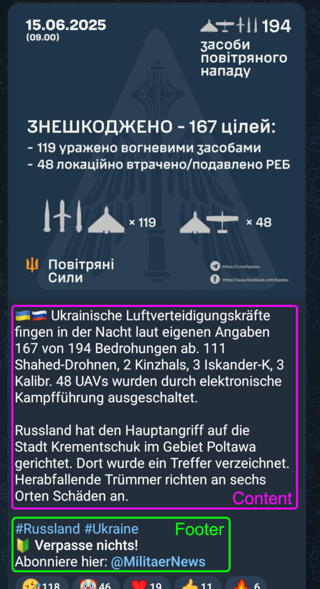
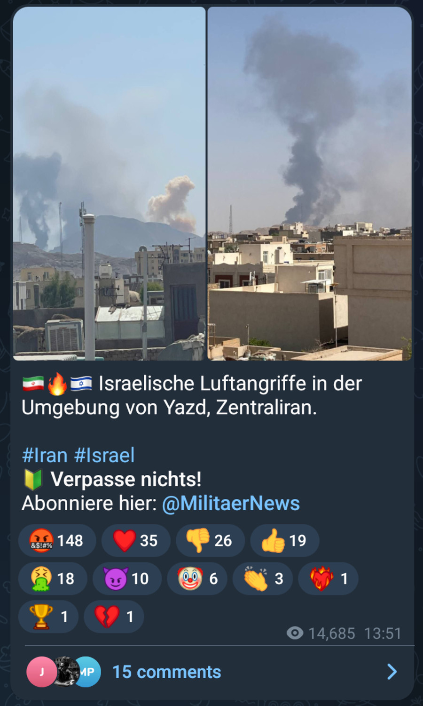
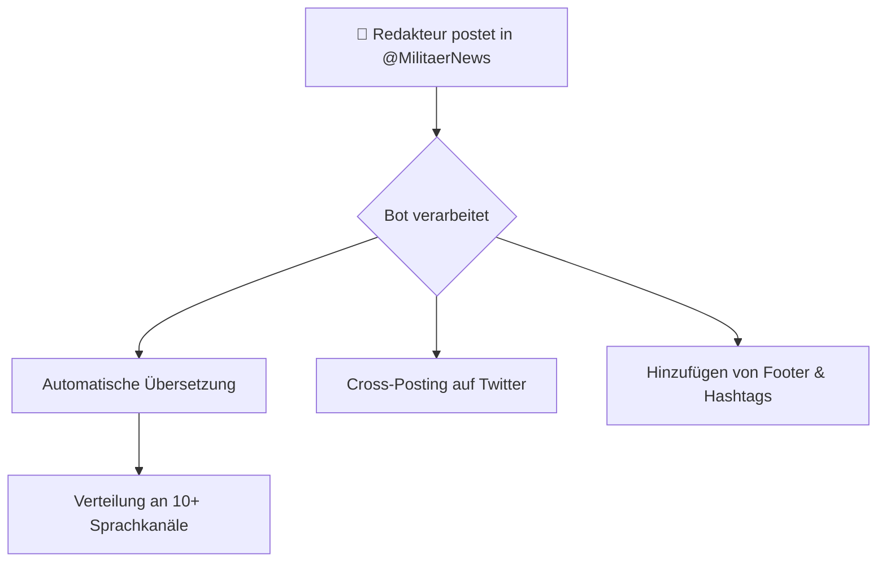

# 🔰 Handbuch für MilitaerNews-Redakteure

Willkommen zum offiziellen Handbuch für Redakteure von MilitaerNews! Dieses Dokument ist Ihr zentraler Leitfaden für die Erstellung und Verwaltung von Inhalten mit unserem automatisierten **Posting Bot**. Ziel ist es, den Prozess so einfach und effizient wie möglich zu gestalten.

## 1. Grundkonzepte: Post, Content & Footer

Jeder Beitrag, den wir veröffentlichen, wird als **Post** bezeichnet. Ein Post setzt sich aus zwei Hauptkomponenten zusammen:

- **Content**: Der eigentliche Inhalt (Text, Bild, Video), den Sie als Redakteur erstellen.
- **Footer**: Ein automatisch vom Bot hinzugefügter Textblock, der Hashtags und einen Link zum Abonnieren des Kanals enthält.

### Caption und Mediengruppen

- **Caption**: Der Text, der unter einem Medium (Bild, Video) angezeigt wird. Das Limit hierfür beträgt **1024 Zeichen**. Da der Footer automatisch hinzugefügt wird, empfehlen wir, die Caption auf ca. **900 Zeichen** zu begrenzen.
- **Mediengruppe (Album)**: Wenn Sie mehrere Medien gleichzeitig senden, erstellt Telegram eine Mediengruppe. Der Bot erkennt dies und wartet einige Sekunden, um sicherzustellen, dass alle Teile des Albums erfasst werden, bevor er den Post weiterverarbeitet.

**Wichtiger Hinweis:** Bei Mediengruppen wird nur die Caption des **ersten** Mediums für die Übersetzung und Weiterleitung verwendet. Alle weiteren Captions sind nur sichtbar, wenn ein Nutzer aktiv durch das Album wischt.

## 2. Die Posting-Pipeline: Von Deutsch in die Welt

Unser System basiert auf einer automatisierten Kette, der **Posting-Pipeline**. Alle Inhalte werden zuerst im deutschsprachigen Kanal **[@MilitaerNews](https://t.me/militaernews)** veröffentlicht und von dort aus weiterverteilt.

### Unterstützte Kanäle

Der Bot beliefert derzeit Kanäle in 11 Sprachen und integriert sich mit Twitter:

| Sprache | Kanal | Telegram | Twitter |
|---|---|---|---|
| 🇩🇪 Deutsch | TG_DE | [@MilitaerNews](https://t.me/militaernews) | [Deutsch](https://x.com/MilitaerNews) |
| 🇺🇸 Englisch | TG_EN | [@MilitaryNewsEN](https://t.me/MilitaryNewsEN) | [Englisch](https://x.com/MilitaryNewsEN) |
| 🇹🇷 Türkisch | TG_TR | [@MilitaryNewsTR](https://t.me/MilitaryNewsTR) | - |
| 🇮🇷 Persisch | TG_FA | [@MilitaryNewsFA](https://t.me/MilitaryNewsFA) | - |
| 🇷🇺 Russisch | TG_RU | [@MilitaryNewsRU](https://t.me/MilitaryNewsRU) | - |
| 🇧🇷 Portugiesisch | TG_PT | [@MilitaryNewsBR](https://t.me/MilitaryNewsBR) | - |
| 🇪🇸 Spanisch | TG_ES | [@MilitaryNewsES](https://t.me/MilitaryNewsES) | - |
| 🇫🇷 Französisch | TG_FR | [@MilitaryNewsFR](https://t.me/MilitaryNewsFR) | - |
| 🇮🇹 Italienisch | TG_IT | [@MilitaryNewsITA](https://t.me/MilitaryNewsITA) | - |
| 🇪🇬 Arabisch | TG_AR | [@MilitaryNewsAR](https://t.me/MilitaryNewsAR) | - |
| 🇮🇩 Indonesisch | TG_ID | [@MilitaryNewsIDN](https://t.me/MilitaryNewsIDN) | - |

## 3. Workflows für Redakteure

### Standard-Post (Text oder Medien)

1.  **Inhalt erstellen**: Verfassen Sie Ihren Text oder wählen Sie Ihre Medien aus.
2.  **Flaggen-Emojis hinzufügen**: Fügen Sie am Anfang des Textes die Flaggen-Emojis der Länder hinzu, über die Sie berichten. Der Bot generiert daraus automatisch die Hashtags.
3.  **Posten**: Senden Sie den Beitrag im Kanal **[@MilitaerNews](https://t.me/militaernews)**.

Der Bot kümmert sich um den Rest: Übersetzung, Footer, Hashtags und Verteilung.

### Nachricht bearbeiten

Um einen bereits veröffentlichten Post zu korrigieren, gehen Sie wie folgt vor:

1.  **Post in [@MilitaerNews](https://t.me/militaernews) bearbeiten**.
2.  **WICHTIG**: Entfernen Sie den gesamten vom Bot hinzugefügten Footer (Trennlinie, Hashtags, Abo-Hinweis).
3.  **Speichern** Sie die Bearbeitung.

Der Bot erkennt die Änderung, weil der Footer fehlt, und startet den Aktualisierungsprozess für alle Sprachkanäle. Anschließend fügt er den Footer im deutschen Kanal wieder hinzu.

**Hinweis**: Twitter-Posts können nicht nachträglich bearbeitet werden.

### Sonderformate: Eilmeldung & Mitteilung

-   **#eilmeldung**: Fügen Sie diesen Hashtag am Anfang Ihres Textes ein. Der Bot entfernt die ursprüngliche Nachricht und postet den Text als Caption unter einem standardisierten "Eilmeldung"-Bild.
-   **#mitteilung**: Funktioniert wie eine Eilmeldung, verwendet aber ein "Mitteilung"-Bild und der Post wird in allen Kanälen angepinnt.
-   **#werbung**: Kennzeichnet einen Beitrag als Werbung und verteilt ihn entsprechend.

## 4. Best Practices & Fehlerbehebung

### ✅ Empfohlenes Vorgehen

-   **Zeichenlimit einhalten**: Planen Sie konservativ mit **~900 Zeichen** für Ihre Caption, um Platz für den Footer zu lassen.
-   **Flaggen statt Hashtags**: Verlassen Sie sich auf die automatische Hashtag-Generierung durch Flaggen-Emojis. Fügen Sie keine manuellen Hashtags hinzu.
-   **Geduld bei Alben**: Mediengruppen benötigen eine längere Verarbeitungszeit. Warten Sie, bis der Prozess vollständig abgeschlossen ist.
-   **Erst posten, dann formatieren**: Um Formatierungsprobleme bei der Übersetzung zu minimieren, senden Sie den Post zunächst unformatiert und bearbeiten Sie ihn anschließend im deutschen Kanal, um Fettungen, Links etc. hinzuzufügen.

### ❌ Zu vermeiden

-   **Manuelle Hashtags**: Diese stören den Bot-Workflow.
-   **Bearbeitung mit Footer**: Wenn Sie einen Post bearbeiten, ohne den Footer zu entfernen, werden die Änderungen **nicht** in andere Kanäle übernommen.
-   **Erwartung sofortiger Weiterleitung**: Große Medien und Alben brauchen Zeit für den Upload und die Verarbeitung.

### Troubleshooting

-   **Post wird nicht weitergeleitet?**
    -   Haben Sie bei der Bearbeitung den Footer entfernt?
    -   Handelt es sich um eine große Datei oder ein Album? Bitte warten Sie einige Minuten.
-   **Formatierung in anderen Sprachen ist fehlerhaft?**
    -   Das ist ein bekanntes Problem bei maschineller Übersetzung. Das Symbol `║` ist ein Platzhalter, der anzeigt, wo die Formatierung nicht korrekt übertragen werden konnte. Ignorieren Sie dies.

## 5. Nützliche Tools

Diese Web-Tools können Ihnen bei der Erstellung von Inhalten helfen:

-   **Chart-Erstellung**: [chart-mn.vercel.app](https://chart-mn.vercel.app/)
-   **Karten-Erstellung**: [geo-mn.vercel.app](https://geo-mn.vercel.app/)
-   **Quellen-Übersicht**: [mix-sv.vercel.app](https://mix-sv.vercel.app/)
-   **Zeichenzähler**: [CharacterCountOnline.com](https://www.charactercountonline.com/)

---

**Zuletzt aktualisiert:** März 2026
